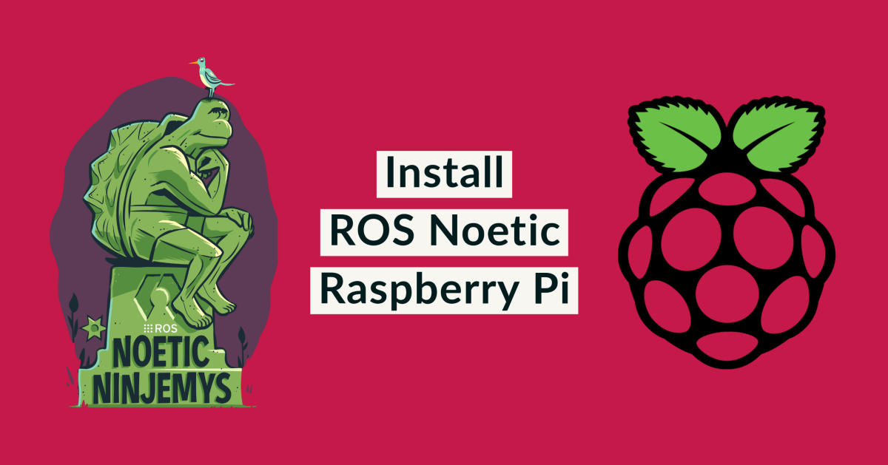

<p align="center"></p>
<br>
<h1 align="center">How to Install ROS Noetic on Raspberry Pi CM4</h1> 
<h4 align="right">May 23</h4>


<br>

Si necesitas inicializar la RPI CM4 
<a href="https://github.com/carjavi/RPI-CM4-getting-started">
</a> 


<br>


> :warning: **Warning:** ROS Noetic Ninjemys salio en Mayo 2020 y va a tener soporte hasta Mayo 2025 (Noetic will be supported until May 2025).

> :memo: **Note:** Se sugiere 8GB RAM, minimo 2GB

> :warning: **Warning:** Corre solamente en sistemas operativos basados en Debian (Buster o Ubuntu)

<br>

## How to Install ROS Noetic on Raspberry Pi 4 OS Debian 10 Buster
https://varhowto.com/install-ros-noetic-raspberry-pi-4/ <br>

[Operating system images](https://www.raspberrypi.com/software/operating-systems/)
 

<br>

## How to Install ROS Noetic on Ubuntu 20.04
https://varhowto.com/install-ros-noetic-ubuntu-20-04/

 [How to install Ubuntu Desktop on Raspberry Pi 4](https://ubuntu.com/tutorials/how-to-install-ubuntu-desktop-on-raspberry-pi-4#1-overview)


<br>

## How to Install ROS Noetic with Docker
 https://varhowto.com/install-ros-noetic-docker/


<br>

---
Copyright &copy; 2022 [carjavi](https://github.com/carjavi). <br>
```www.instintodigital.net``` <br>
carjavi@hotmail.com <br>
<p align="center">
    <a href="https://instintodigital.net/" target="_blank"></a>
</p>